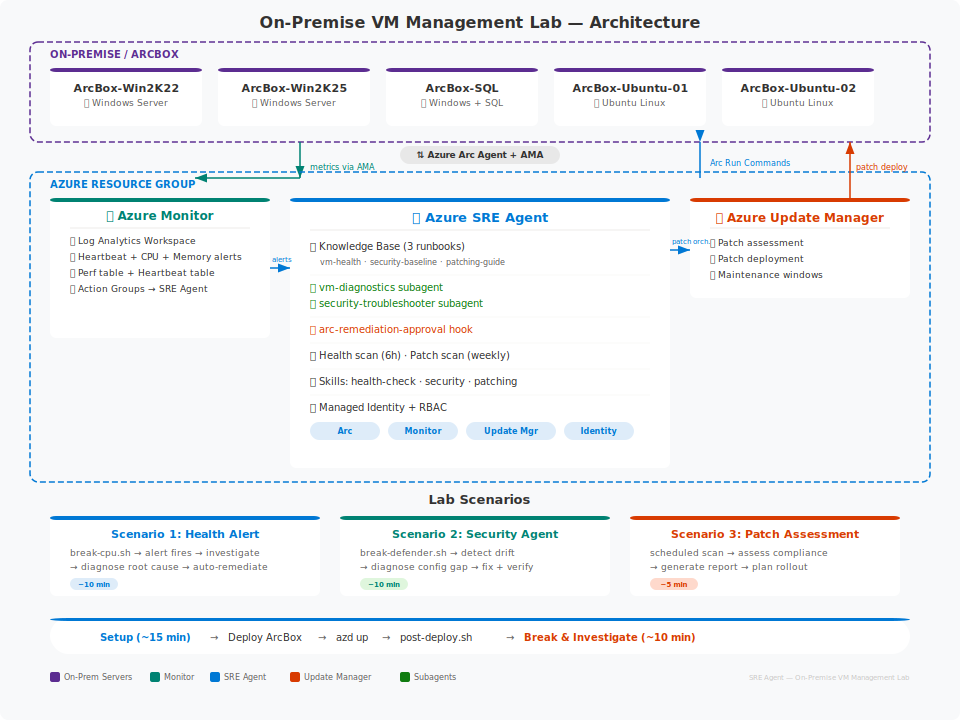

# On-Premise VM Management with Azure SRE Agent

Deploy an Azure SRE Agent that monitors, diagnoses, and remediates issues on **on-premise servers via Azure Arc** — with a single `azd up` command.

**Learn more:** [What is Azure SRE Agent?](https://sre.azure.com/docs/overview) · [What is Azure Arc?](https://learn.microsoft.com/azure/azure-arc/overview)

## Architecture

<p align="center">
  
</p>

## Prerequisites

### Required Tools

| Tool | macOS | Windows |
|------|-------|---------|
| [Azure CLI](https://learn.microsoft.com/cli/azure/install-azure-cli) 2.60+ | `brew install azure-cli` | `winget install Microsoft.AzureCLI` |
| [Azure Developer CLI](https://learn.microsoft.com/azure/developer/azure-developer-cli/install-azd) 1.9+ | `brew install azd` | `winget install Microsoft.Azd` |
| [Python](https://python.org) 3.10+ | `brew install python3` | `winget install Python.Python.3.12` |

### Azure Requirements

- Active Azure subscription with **Owner** role
- **ArcBox for IT Pros** deployed — [setup guide](https://jumpstart.azure.com/azure_jumpstart_arcbox/ITPro)
- Register providers:
  ```bash
  az provider register -n Microsoft.App --wait
  az provider register -n Microsoft.HybridCompute --wait
  ```

### ArcBox Servers (managed by this lab)

| Server | OS | Role |
|---|---|---|
| ArcBox-Win2K22 | Windows Server 2022 | Application Server |
| ArcBox-Win2K25 | Windows Server 2025 | File Server |
| ArcBox-SQL | Windows Server 2022 + SQL 2022 | Database Server |
| ArcBox-Ubuntu-01 | Ubuntu 22.04 LTS | Web Server |
| ArcBox-Ubuntu-02 | Ubuntu 22.04 LTS | Monitoring Server |

## Quick Start

```bash
# 1. Check prerequisites
bash scripts/prereqs.sh

# 2. Deploy SRE Agent + monitoring (Bicep templates)
cd labs/onprem-vm-management
azd env new sre-onprem
azd env set ARC_RESOURCE_GROUP rg-arcbox-itpro
azd up

# 3. Configure agent (skills, hooks, tasks, runbooks)
bash scripts/post-deploy.sh

# 4. Open SRE Agent portal and ask:
#    "What Arc servers are in my environment?"
```

> **What gets deployed:** SRE Agent instance, Log Analytics Workspace, Application Insights, 3 alert rules (heartbeat / CPU / memory), RBAC roles — all via **Bicep templates**. No VMs are deployed; ArcBox provides the servers.

## Try It — 3 Demo Scenarios

### 🔴 Scenario 1: Server Health Alert

```bash
bash scripts/break-cpu.sh ArcBox-Win2K22
```

CPU spikes → Azure Monitor alert fires → SRE Agent auto-investigates using `wintel-health-check` skill → runs `Get-Process | Sort CPU` via Arc Run Command → proposes remediation → approval hook asks you to confirm.

### 🟡 Scenario 2: Security Agent Failure

```bash
bash scripts/break-defender.sh ArcBox-Ubuntu-01
```

Defender disabled → Defender for Cloud detects unhealthy MDE → SRE Agent uses `security-agent-troubleshooting` skill → runs `mdatp health` via Arc → auto-remediates → verifies fix.

### 🟢 Scenario 3: Patch Assessment

In the SRE Agent chat, type:
> Run a patch assessment on all my Arc servers

Agent queries Azure Update Manager → runs OS-specific pre-patch checks via Arc Run Commands → generates risk report with deployment wave plan (Ubuntu → Windows → SQL).

See [docs/demo-scenarios.md](docs/demo-scenarios.md) for detailed walkthroughs.

## What's Configured

| Type | Items |
|---|---|
| **Skills** | `wintel-health-check` · `security-agent-troubleshooting` · `patch-validation` |
| **Subagents** | `vm-diagnostics` · `security-troubleshooter` |
| **Hook** | `arc-remediation-approval` — approval gate for all write operations |
| **Scheduled Tasks** | Health scan (every 6h) · Patch assessment (weekly) |
| **Knowledge Base** | Server health runbook · Defender troubleshooting · Patch management |
| **Alerts** | Heartbeat loss (Sev 0) · High CPU (Sev 1) · High memory (Sev 2) |

All diagnostics are **OS-aware** — the agent automatically detects Windows vs Linux and runs the right commands (PowerShell vs bash). SQL Server gets additional checks (service health, database status, CU patches).

## Companion Repository

For advanced automation (PowerShell demo scripts, ITSM/GLPI integration, Python adapters):
→ [ops-automation-using-sre-agent](https://github.com/prwani/ops-automation-using-sre-agent)

## Cleanup

```bash
azd down --purge
```

> ArcBox must be cleaned up separately.
